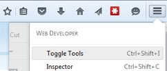

!!!note
    I personally be using my own Ubuntu system and not a VM. You are free to do whichever you wish, but the VM environment below can be quite slow.
# Introduction to Vagrant and PHP with text editor, Home setup

## Part 1 – Vagrant virtual machine provisioning

We are using Vagrant in this course to ensure all students have the same
virtual machine configured on all lab computers and at home. Vagrant is
a tool that greatly helps sharing Virtual Machines with the exact same
configuration. The vagrant box that we use is Homestead, which is
recommended by Laravel (a PHP framework that we will use later in the
semester).

Homestead has the following development stack preinstalled: Ubuntu
Linux, NginX web server, PostGres database, PHP.

In the first part of the lab, we will explore our system, make sure that
we can boot the virtual machine on the lab workstation and execute a
basic PHP script.

## Create the Homestead folder

Copy the folder `S:\\CompSci\\524\\Homestead to your H: drive`. You should
now have H:\\Homestead directory with the same contents as
`S:\\CompSci\\524\\Homestead`.

**Create the shared folder

One of the really nice features of Vagrant is how easy it is to get both
the host system (Windows 10 machine) and the virtual machine (Ubuntu) to
see and share the same directory.

Create a folder called PHPCode in your H: drive. You will save all your
labs and projects in this folder. Create the following directories
within PHPCode to match the lab setup:

> - labs
>
> - badresto
>
> - reader
>
> - dawson
>
> - news
>
> - todo

(spoiler: these are some of the labs and projects you’ll be working on
this semester!)

## Get your ssh keys

Check if you already have a .ssh folder in your home directory (H: drive
should be setup as your $HOME in the labs). If you have an .ssh
directory, you have already generated ssh keys (probably for git). If
not:

Open a Git Bash console in your H drive (right-click in Windows
Explorer, Git Bash Here)

Make sure you are in H: &gt; pwd

Run these commands:
```bash
$ mkdir -p .ssh && cd .ssh
```
```bash
$ ssh-keygen -t rsa -b 4096 -C "youremail@address.here"
```
Press enter to save the key in `/h/.ssh/id\_rsa`

## Boot the virtual machine configured for the PHP course

You will be doing this every lab:

Open a Git Bash window in `H:/Homestead` (right-click in explorer). This
opens a Bash shell emulator on your Window system.

Make sure you are in `/h/Homestead`

Run this command:
```bash
$ vagrant up
```

When this command finishes (a few minutes) your Virtual Machine is up
and running!!

## SSH into the virtual machine

Our Ubuntu VM is headless – meaning that we don’t have a GUI interface
to Linux. Yay Command line only

Whenever you want to log into the booted VM (e.g., to check the
configuration or access the database), type in this command from your
Git Bash window in `H:\\Homestead`.

```bash
$ vagrant ssh
```
You are now in the VM!

`cd` to the Code directory `-&gt`; you are now in the PHPCode shared folder
So the `H:/PHPCode` folder in Windows is the same as the
`/home/vagrant/Code` folder in the VM.

> NOTE: there is a known Vagrant bug where you may not see the command
> prompt while `ssh`-ing with vagrant `ssh`. If that is that case, exit and
> try `ssh vagrant@192.168.10.10`, with password `vagrant`

This “magic” of the shared directory is courtesy of the `Homestead.yaml`
file. If you open it in Notepad++ (or use less or nano or vim from the
Linux side), you’ll see a section that indicates the folder mapping.

## Run a simple script

Once the VM is up and running, we can run PHP scripts.

Copy `S:/CompSci/524/lab0` to your `H:/PHPCode/labs folder`.

Open a browser (hint: Firefox is my favourite), and go to
<http://labs.app/lab0>

You should see a page that contains output of the PHP configuration on
the VM. Don’t worry too much about the content, if you see it, you know
your VM is serving up your PHP files as required.

How does this work?

All the lab computers have been set to associate certain hostnames to
itself: you can see this in the file

`C:/Windows/System32/drivers/etc/hosts`

Notice, for example, that the host labs.app is associated with the IP
address `192.168.10.10` (in fact all hostnames are associated with this IP
address). The hosts file enables you to override the DNS for a domain on
that machine. Your machine will look at the IP address provided
(`192.168.10.10`) instead of going through a DNS. This IP address
(`192.168`) is in the private IP address range, so we can map with no
worries.

Now look at `H:/Homestead/Homestead.yaml`: you will see that the IP
address is the one being used by you Vagrant VM 9and its NginX web
server. Further down, you see that the sites are associated with
different folders in VM; these folders are all in the shared
`/home/vagrant/Code` folder (which is your `H:/PHPCode` folder)

If you open the `lab0/index.php file`, you will a single line in the php
tags `– phpinfo()` is the function that outputs the PHP configuration.

NginX, the web server, is configured by default to return `index.html`,
`index.html` directly, or interpret `index.php` through the PHP interpreter.
That’s what happened when you browsed to `labs.app/lab0`.

## Create and debug your own PHP Script

Create a folder `H:\\PHPCode\\labs\\lab1` (or in the Linux VM
`Code/labs/lab1` in the VM), and write a PHP script named index.php that
will create the output as shown in the image, using a text editor like
Notepad++ or Atom.

-    use HTML5
    tags, including doctype and html tag

-   the php code will fill in the contents of a table, with echo’s
    within a nested loop

-   no styling is required

-   recall: PHP variable names start with $; for loops look pretty much
    the same as java.

-   [PHP coding
    conventions](https://github.com/php-fig/fig-standards/blob/master/accepted/PSR-2-coding-style-guide.md)
    use the “Egyptian brackets”/”K&R style braces” in control structures
    – which means the opening brace is written on the same line as the
    conditional clause and the closing brace is always written on its
    own line.

> E.g.:
>
> if ($a != 2) {
>
>     $a = 2;
>
> }
>
> *(As an aside, this is also the* [*common Java style
> *](https://google.github.io/styleguide/javaguide.html)*).*

## Testing the PHP Script

Browse to [**http://labs.app/lab1**](http://labs.app/lab1). Since we
named the file index.php, NginX will open it by default. If you named it
something else, write it in the address bar.

  
The results of the program should appear!

Recall: Firefox (as well as the other major browsers) come with a suite
of developer tools. Open the menu in Firefox, select Developer and
Toggle Tools (or Ctrl+Shift+I). You will see the http messages and other
information that is **very** useful when debugging web applications.

## Shutting down the VM

Use the command vagrant halt to gracefully shutdown your VM. Note that
the VM is subject to deep-freeze, so any changes anywhere except the
shared folder will be lost the next time you log in.

## SOLVING INTERMITTENT 502 BAD GATEWAY ISSUES

If you are victim, you may have to make sure that nginx and php config
match:

Go to `/etc/php/7.1/fpm/pool.d/` , edit `www.conf` (use `sudo nano`) and edit
the line `listen = /run/php/php7.1-fpm.sock` to
`listen = var/run/php/php7.1-fpm.sock`

Exit and save the file, then run `sudo service php7.1-fpm restart`

## Setting up your laptop/home system

The following instructions are provided for a Windows 7.1+ syste, If you
are running Linux or IOS, the steps will be simpler. See this
[link](https://laravel.com/docs/5.4/homestead), and compare to the notes
below.

1.  make sure your BIOS/UEFI supports hardware virtualization and it is
    enabled

2.  make sure HyperV is disabled (Control panel - uninstall a program –
    program and features – turn Windows features on/off –
    uncheck HyperV)

3.  install Git for Windows to have gitbash:
    [*https://git-for-windows.github.io*](https://git-for-windows.github.io/)

    -   choose default install options (select Windows
        Explorer Integration. Select **Use Git from the Windows Command
        Prompt** radio button so that Git can be run from the
        command line.)

4.  install VirtualBox 5.1.x (latest version) :
    [*https://www.virtualbox.org/wiki/Downloads*](https://www.virtualbox.org/wiki/Downloads)

5.  install Vagrant 1.9.x (latest version):
    https://www.vagrantup.com/downloads.html

6.  if desired, setup your hosts to be the same as school

-   open Notepad as admin

-   Edit C:/Windows/System32/drivers/etc/hosts (nb: make sure Notepad is
    looking at all files, not just .txt)

-   Add to the end:

```
192.168.10.10 dawson.app

192.168.10.10 news.app

192.168.10.10 todo.app

192.168.10.10 labs.app

192.168.10.10 reader.app

192.168.10.10 badresto.app
```
1.  get your ssh keys, if required. Follow the steps in the lab above to
    check if they exist in the $HOME directory

2.  decide where you want your Homestead and PHPCode directories and
    make them

3.  In the containing directory:

    -   open gitbash

    -   run the following commands:
```bash
$ vagrant box add laravel/homestead
```
```bash
$ git clone https://github.com/laravel/homestead.git Homestead
```
```bash
$ cd Homestead
```
```bash
$ git checkout v5.4.0
```
```bash
$ bash init.sh
```
1.  edit the `Homestead/Homestead.yaml` file (look at the one you have in
    your `H:` drive)

-   in the folders section, provide to mapping to the PHPCode folder you
    created in step 8. e.g.,

folders:

- map: `h:/PHPCode`

to: `/home/vagrant/Code`

-   if you added the sites to the `etc/hosts` files, also add them to
    the `Homestead.yaml`. For example:
```
sites:

- map: labs.app
```

to: `/home/vagrant/Code/labs`

1.  each time you want to boot up:`vagrant up`

2.  to ssh in: either `vagrant ssh` or `ssh vagrant@192.168.10.10`, with
    password `vagrant`

3.  to shut down: `vagrant halt`

## Debugging your system

When you vagrant up, if you get the message that a Virtual Machine with the name Homestead-7 already exists, it indicates that you VM was not shutdown correctly. 

To fix this:

- find the Oracle VM VirtualBox application and open it
- you will notice a VM called Homestead-7 which is running
- right-click on it to close it
- right-click on it to remove it and delete all files
- close your bash window, reopen, and retry
- if you still have issues, you may have to delete folders: in the `Homestead\.vagrant\machines` folder as well as the `VirtualBox VMs\` folder. Always close and reopen your bash window.

if you need to edit your Homestead.yaml file, make sure that vagrant halt first. Once the file is saved, start vagrant with the command vagrant up --provision. This will ensure that vagrant re-reads the Homestead.yaml file.

The Homestead.yaml file is notoriously sensitive to bad spacing. This may be a cause of issues that you encounter

One really unfortunate side-effect of Dawson’s deep freeze system is that changes that you make to the VM get lost every time you logout (changes to the php config files, or your database, or installation of tools, or …). This can get irritating. If possible, you may prefer to use your laptop in the labs.